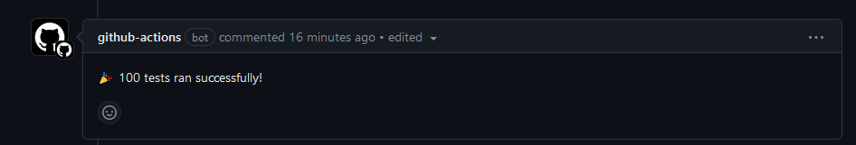

# 💬 Unique PR Comments

[](https://sonarcloud.io/summary/new_code?id=spicyparrot_pr-comment-action)
[](https://sonarcloud.io/summary/new_code?id=spicyparrot_pr-comment-action)
[](https://sonarcloud.io/summary/new_code?id=spicyparrot_pr-comment-action)
[](https://sonarcloud.io/summary/new_code?id=spicyparrot_pr-comment-action)

## Overview

This is a pipeline action to add comments to pull requests and allows for editing previous comments to help keep PRs tidy!

This is useful during testing to leave summaries about the latest test results in a visble location

## Features

- Comment Editing - ability to edit a previous comment with the latest comment to minimise the number of comments on a PR
- Comment File - output test results into a txt file that can be converted into a markdown comment

## Usage

### Inputs

| Input       | Required     | Example      | Description   |
|-------------|--------------|--------------|---------------|
| `comment`         | true  | "Tests are passing"       | Your comment!    |
| `comment_path`    | false | '/tmp/test_results.txt'   | Global path to a text file which will also be added to the comment |
| `comment_id`      | false | 'test_group_a'            | The id used to determine if a comment should be created or edited    |

### Comment Only

```yaml
jobs:
  test-code:
    runs-on: ubuntu-latest
    steps:
      - name: 🧪 Run Tests
        run: echo "SOME TEST"

      - name: 💬 PR Comment
        uses: spicyparrot/pr-comment-action@v1.0.0
        with:
          comment: "🥼 Tests Results"
```

Github comment 

### With Comment File

```yaml
jobs:
  test-code:
    runs-on: ubuntu-latest
    steps:
      - name: 🧪 Run Tests
        run: echo "SOME TEST"

      - name: 💌 Comment File
        id: comment_file
        run: |
          COMMENT_PATH=$(pwd)/temp_output.txt
          echo "| Test Case | Result " > $COMMENT_PATH
          echo "| ----------- | ----------- |" >> $COMMENT_PATH
          echo "| 🦜     |   🌶️   |" >> $COMMENT_PATH
          echo "file_path=${COMMENT_PATH}" >> $GITHUB_OUTPUT

      - name: 💬 PR Comment
        uses: spicyparrot/pr-comment-action@v1.0.0
        with:
          comment: "🥼 Test Results"
          comment_path: ${{ steps.comment_file.outputs.file_path }}
```

Github comment 